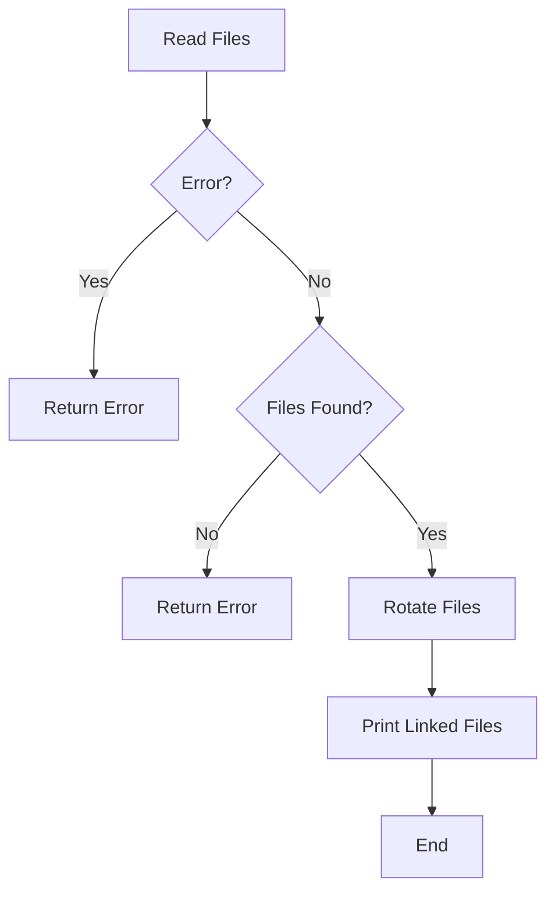

# Backup File Rotation Script (alpha)

This CLI application implements a backup file rotation strategy using a generational backup approach. It reads files from a source directory, parses dates from filenames, and rotates the files based on specified retention policies.

The application will create symlinks in a directory for easy access pointing to the selected backup file.

All files without a symlink will be deleted if the `--dry` flag is not present.

During initialization the application deletes all symlinks and starts determining the files to keep.

## Features

- Reads files from a specified source directory.
- Parses dates from filenames using a regular expression.
- Implements a generational backup strategy.
- Deletes old files based on retention policies.
- Copies remaining files to a destination directory.
- Supports dry run mode to preview actions without making changes.
sees`: Number of yearly backups to keep.
- `--source`: Source directory containing backup files.
- `--destination`: Destination directory for rotated backups.
- `--dry-run`: Enable dry run mode to preview actions.

### Example

```bash
$ backup-rotator --keep 5 --keep-days 7 --keep-weeks 4 --keep-months 12 --keep-years 5 --source-dir /path/to/source --destination-dir /path/to/destination --dry
```



## Testing

Extract the backupfiles.zip folder and create a destination folder where the symlinks should be stored.

Execute the rotator with the two paths and inspect the created symlinks.

If the symlinks are good, change some parameters.

Remove the "--dry" Flag and watch the "not linked" files beeing deleted.